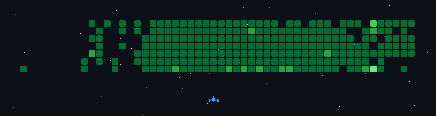

<div align="center">


# Madhu Koseke

### Data Engineer → AI Engineer

Building data platforms, AI systems, and open-source tools.

[GitHub](https://github.com/madhukoseke) · [LinkedIn](https://www.linkedin.com/in/madhukoseke/) · [Writing](https://medium.com/@madhukoseke)

</div>

---

## About

Senior Data Engineer with 11+ years in software engineering, specializing in large-scale data platforms, distributed systems, and cloud infrastructure.

I am now going deeper into AI engineering, agentic systems, local inference, and developer tooling. I enjoy turning complex infrastructure problems into reliable systems and sharing what I learn through open source.

## Selected work

<table>
<tr>
<td width="50%" valign="top">

### [Data Engineering Skill ↗](https://github.com/madhukoseke/de-skills)

A vendor-neutral agent skill for designing, building, reviewing, and operating production data systems.

<sub>Python · SQL · Spark · dbt · Airflow</sub>

</td>
<td width="50%" valign="top">

### [AirMemory ↗](https://github.com/madhukoseke/AirMemory)

Graph-based operational memory for Apache Airflow that connects failures, lineage, root causes, and validated fixes.

<sub>Python · Airflow · Cognee · FastAPI</sub>

</td>
</tr>
<tr>
<td width="50%" valign="top">

### [ForgeGuard ↗](https://github.com/madhukoseke/ForgeGuard)

An open-source guardrail layer that places policy checks, approvals, audit trails, and rollback between AI agents and databases.

<sub>TypeScript · MCP · PostgreSQL · Next.js</sub>

</td>
<td width="50%" valign="top">

### [Local AI Agent ↗](https://www.linkedin.com/in/madhukoseke/)

A private, locally inferred agent built with NemoClaw, OpenShell, and OpenClaw. Awarded first place at the Dell Technologies × NVIDIA AI Factory Hackathon.

<sub>Local AI · Open Source Models · GB10</sub>

</td>
</tr>
<tr>
<td width="50%" valign="top">

### [Age of AI Agents ↗](https://github.com/madhukoseke/age-of-ai-agents)

A multi-agent research workflow where specialized agents gather, fact-check, and synthesize information into structured reports.

<sub>Python · Google ADK · Gemini · Multi-Agent Systems</sub>

</td>
<td width="50%" valign="top">

### [21 Days of Python ↗](https://github.com/madhukoseke/21daysofpython)

A hands-on Python curriculum with 21 daily notebooks, practical exercises, reference notes, and a final project.

<sub>Python · Jupyter · Learning in Public</sub>

</td>
</tr>
</table>

## Current build focus

<sub>A directional view of where I am investing my learning and side-project time. These bars show focus, not proficiency.</sub>

```text
AI Engineering       ███████████████████░  Primary
Agentic Systems      █████████████████░░░  Building
Local AI             ███████████████░░░░░  Exploring
Developer Tools      █████████████░░░░░░░  Ongoing
```

---

## Languages & tools

<div align="center">


</div>

## GitHub activity

<div align="center">

[](https://github.com/madhukoseke)
[](https://github.com/madhukoseke)
[](https://github.com/madhukoseke)

### Contributions, but make it a game



<sub>Generated daily from my GitHub contribution graph.</sub>

</div>

---

<div align="center">

### Elsewhere

[GitHub](https://github.com/madhukoseke) · [LinkedIn](https://www.linkedin.com/in/madhukoseke/) · [Medium](https://medium.com/@madhukoseke)

<sub>Build reliable systems. Stay curious. Share what works.</sub>

</div>
